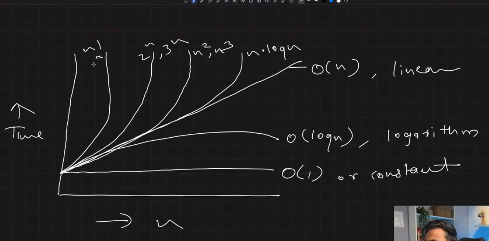

complexity representation
big O --> upper bond/worst case
thetha--> average case
omega -->lower bond /best case

O(5) --> Constant Time Complexity (value will be  fixed e.g - print hello world for 5 times)

O(n) --> linear time complexity(n=100 but your fuction perform  operation near the 60 iteration e.g - linear search)

O(n^2) --> quatratic time complexity(nested loop which perform linear time complexity e.g - bubble sort,insertion sort)

O(log) --> logrithem time complexity(n=500 but elastically perform only 8 operation e.g - binary search)

2^n -->

n! --> factorial time complexity

